## Я реализовал комплексную настройку сетевой инфраструктуры на базе Linux, включающую:
- Настройку статической маршрутизации и NAT.
- Управление сетевым трафиком через iptables.
- Развертывание DHCP-сервера.
- Написание набора Bash-скриптов для автоматизации анализа дискового пространства (поиск и сортировка топ-файлов/папок по размеру).

## Статическая маршрутизация сети

По такому примеру мы будем делать нашу сеть:

#### Настройка адресов машин

Настроили роутеры:

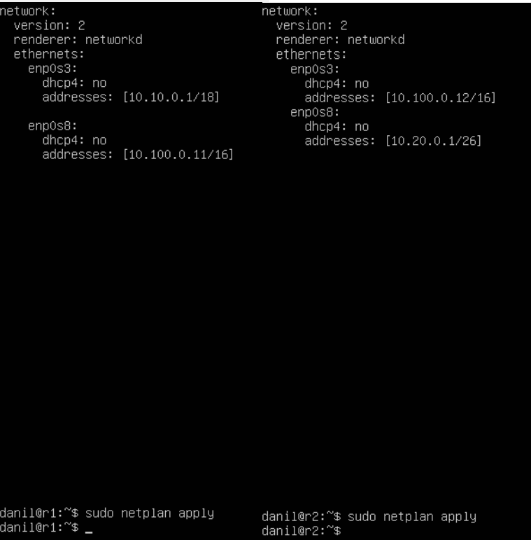  

И хосты:

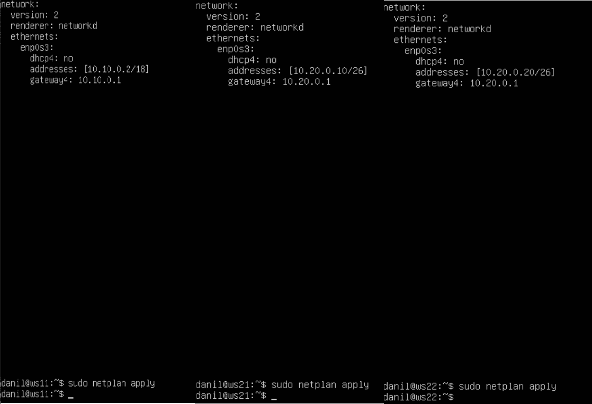

Проверили, что все сработало командой: `ip -4 a`

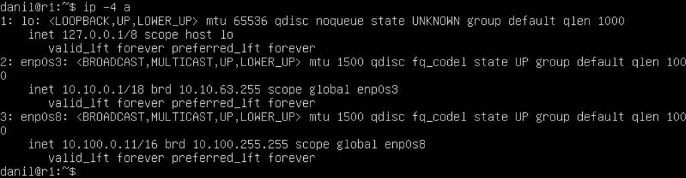

Ping-уем ws22 с ws21  

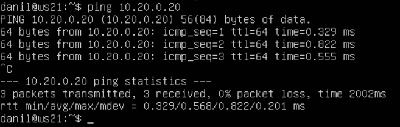

Ping-уем r1 с ws11

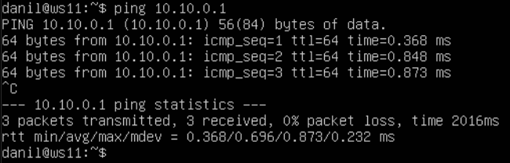

#### Включение переадресации IP-адресов

##### Для включения переадресации IP выполнили команду на роутерах:
`sysctl -w net.ipv4.ip_forward=1`

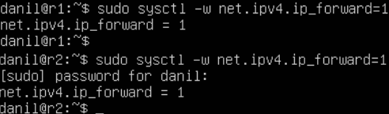

*При таком подходе переадресация не будет работать после перезагрузки системы.*

##### Открыли файл */etc/sysctl.conf* и добавили в него следующую строку:
`net.ipv4.ip_forward = 1`  

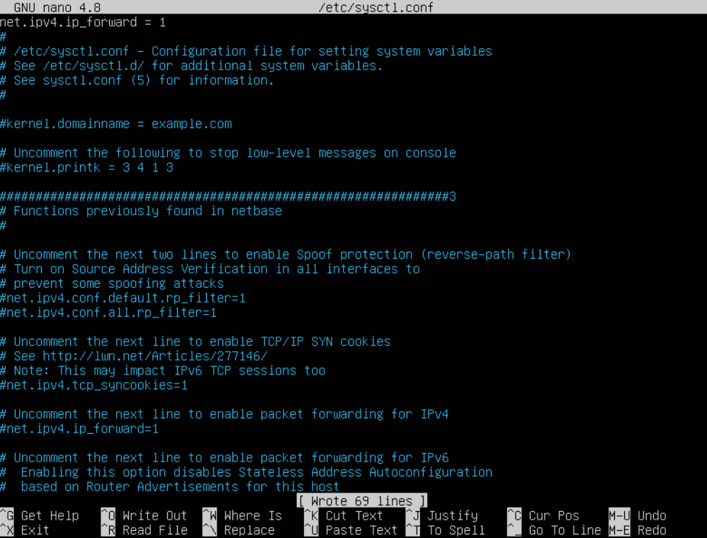

*При использовании этого подхода, IP-переадресация включена на постоянной основе.*  

#### Установка маршрута по умолчанию

##### Настроили маршруты по умолчанию (шлюз) для рабочих станций.

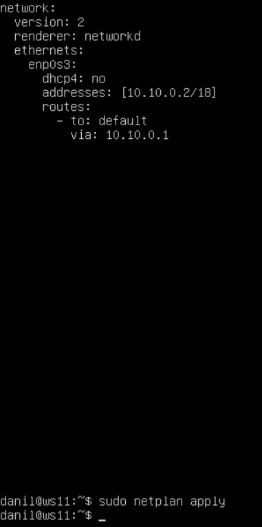

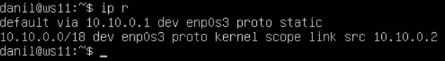

На ws11 вводим: ping 10.100.0.12

Как видим, пакеты доходят до r2  

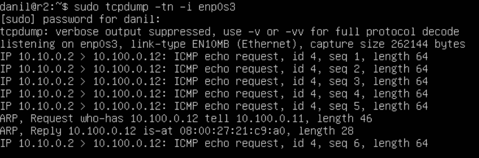

#### Добавление статических маршрутов
##### Добавили в роутеры r1 и r2 статические маршруты в файле конфигураций.

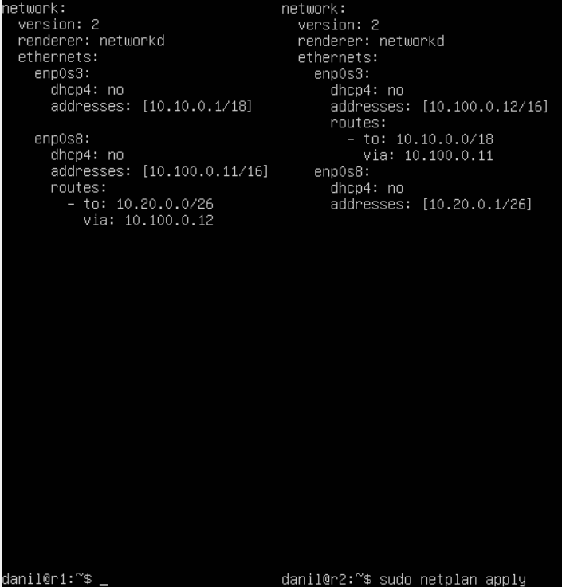

##### Вызвали `ip r` и показали таблицы с маршрутами на обоих роутерах. 

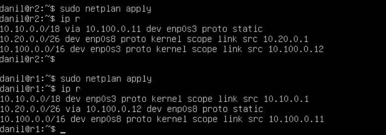

##### Запустили команды на ws11:
`ip r list 10.10.0.0/[маска сети]` и `ip r list 0.0.0.0/0`

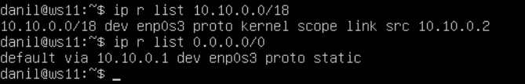

Используется правило приоритета маски.  

Система всегда выбирает маршрут с самой длинной маской (префиксом).  
Маска /18 длиннее, чем маска /0, поэтому она приоритетнее.  
Маршрут 10.10.0.0/18 описывает конкретную локальную сеть, а 0.0.0.0/0 это общий путь для всех остальных адресов, который используется в последнюю очередь.

#### Построение списка маршрутизаторов

##### Запустили на r1 команду дампа:
`tcpdump -tnv -i eth0`

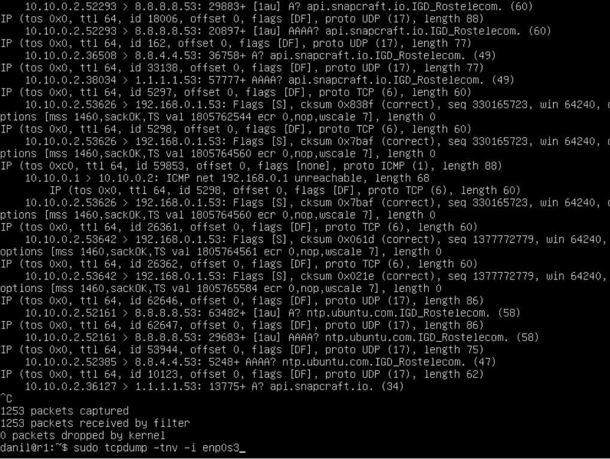

##### При помощи утилиты **tracepath** построили список маршрутизаторов на пути от ws11 до ws21. 

А смысл работы tracepath следующий:  
Tracepath показывает маршрут до адресата, подписывает ttl - time to leave, если он закончится раньше времени, то пакет не дойдет.

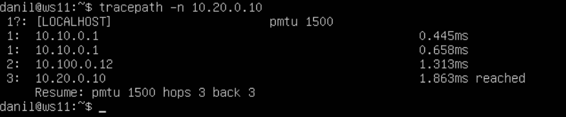

#### Использование протокола **ICMP** при маршрутизации
##### Запустили на r1 перехват сетевого трафика, проходящего через eth0 с помощью команды:
`tcpdump -n -i eth0 icmp`
##### Пропинговали с ws11 несуществующий IP (например, *10.30.0.111*) с помощью команды:
`ping -c 1 10.30.0.111`

Вывод:

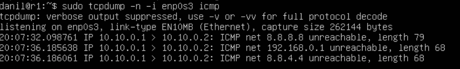

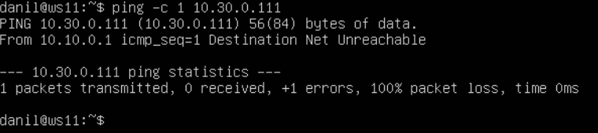

## Динамическая настройка IP с помощью **DHCP**

##### Для r2 настроили в файле */etc/dhcp/dhcpd.conf* конфигурацию службы **DHCP**:
##### 1) Указали адрес маршрутизатора по умолчанию, DNS-сервер и адрес внутренней сети.

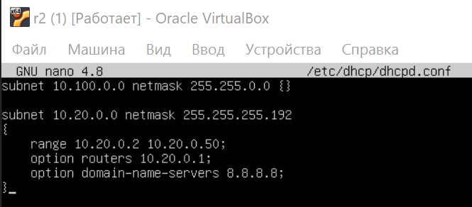

##### 2) В файле *resolv.conf* прописали `nameserver 8.8.8.8`.

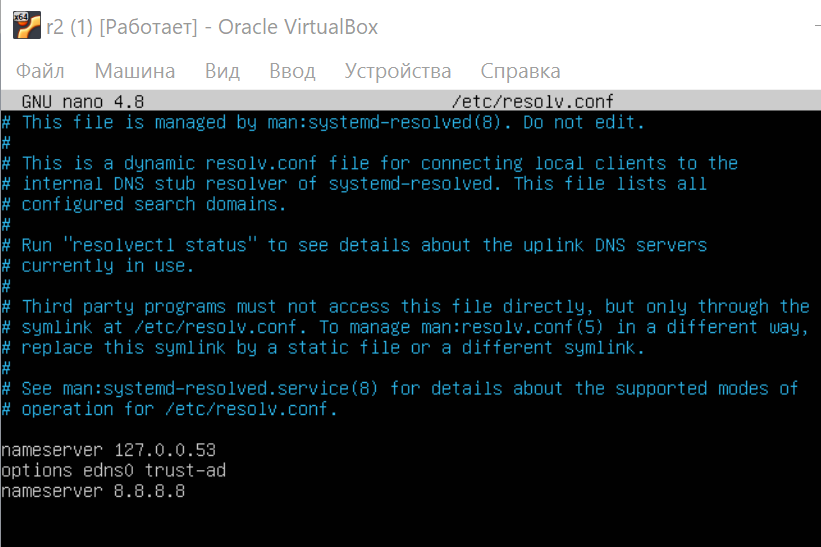

##### В /etc/default/isc-dhcp-server прописали интерфейс второй сети, чтобы туда раздавились адреса.   

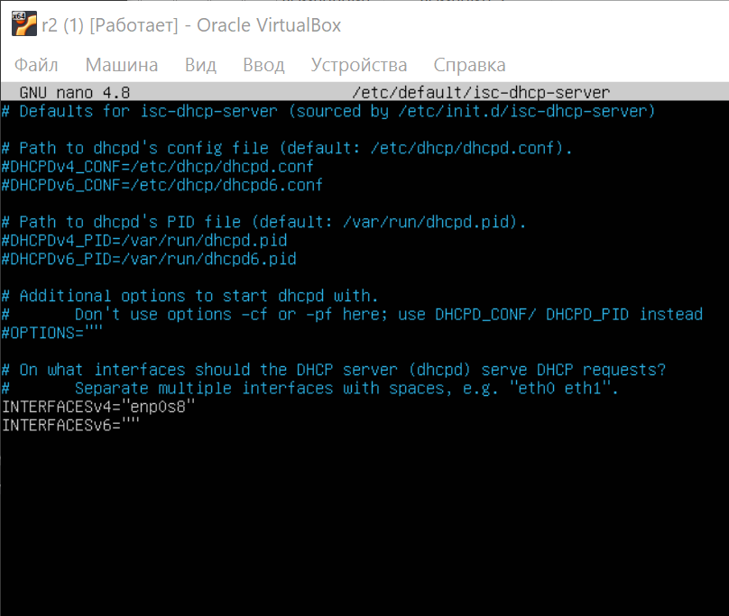

##### Перезагрузили службу **DHCP** командой `systemctl restart isc-dhcp-server`. Посмотрели, что там происходит:

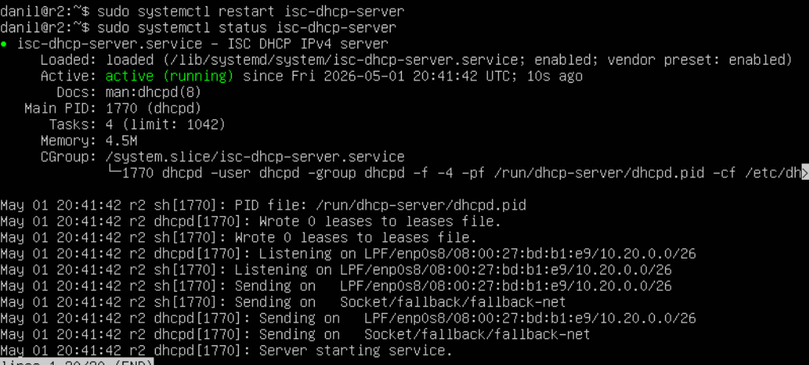

###### Машину ws21 перезагрузили при помощи `reboot` и через `ip a` показали, что она получила адрес. Также пропингуем ws22 с ws21.

Включили dhcp на ws21 и ws22 и убрали статичные адреса, теперь конфиг выглядит так:

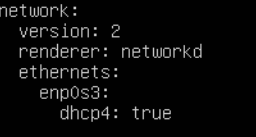

Результат пинга и вывод ip a:

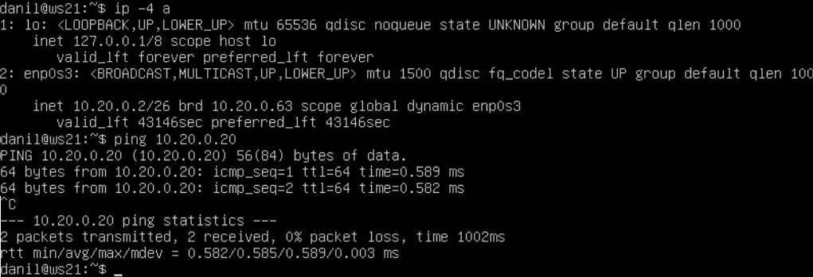

##### Указываем MAC-адрес у ws11, для этого в *etc/netplan/00-installer-config.yaml* надо добавить строки: `macaddress: 10:10:10:10:10:BA`, `dhcp4: true`.

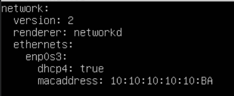

-Cкрин с содержанием изменённого файла *etc/netplan/00-installer-config.yaml*.

Не забываем заменить mac-адрес в настройках vbox.  

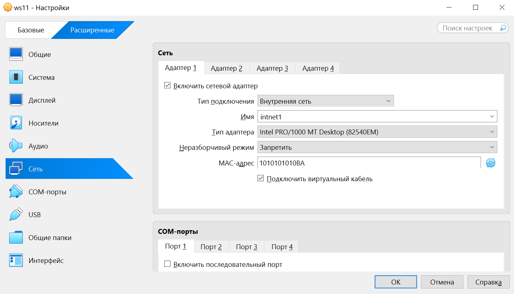

##### Для r1 настроили аналогично r2, но сделали выдачу адресов с жесткой привязкой к MAC-адресу (ws11). Проводим аналогичные тесты.

Настроили /etc/dhcp/dhcpd.conf в r1:

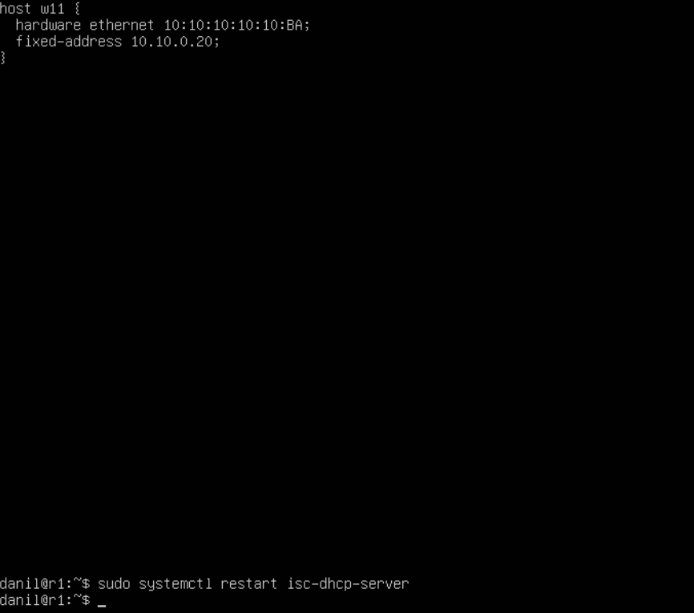

##### Запросили с ws21 обновление IP-адреса.
- В отчёте поместили скрины IP до и после обновления.

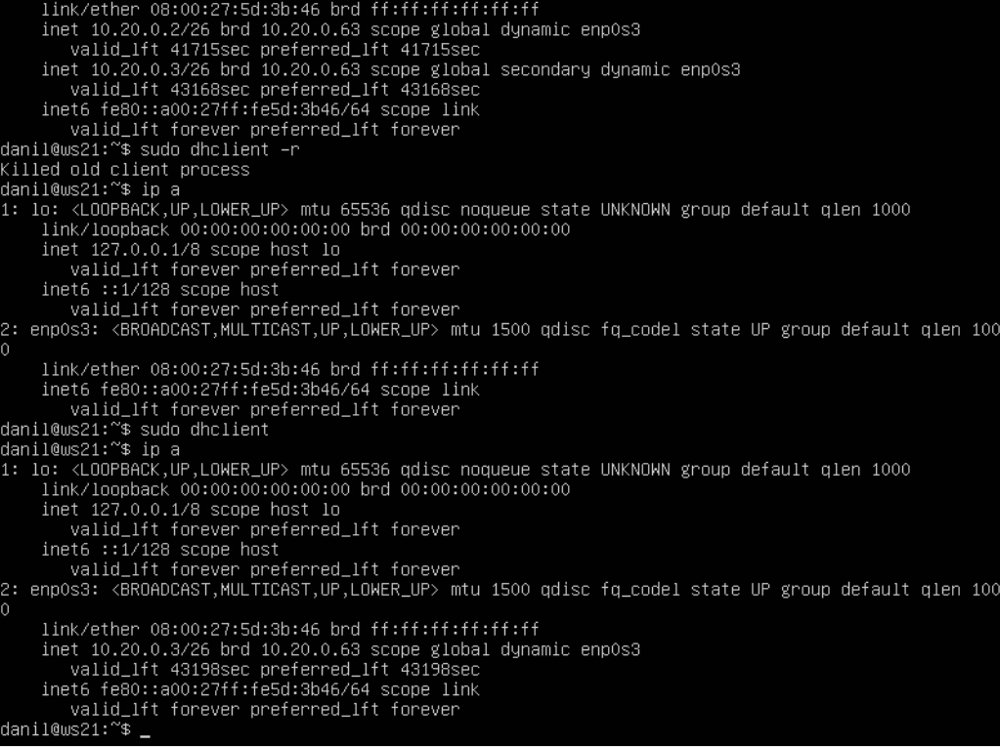

- Описание опций **DHCP** сервера в данном пункте.

- dhcp release, для это использутеся флаг -r для принудительного удаления ip адреса.  
- dhcp discover, для поиска нового адреса, для это пишем dhclient.

## **NAT**

##### В файле */etc/apache2/ports.conf* на ws22 и r1 изменили строку `Listen 80` на `Listen 0.0.0.0:80`, то есть сделали сервер Apache2 общедоступным.

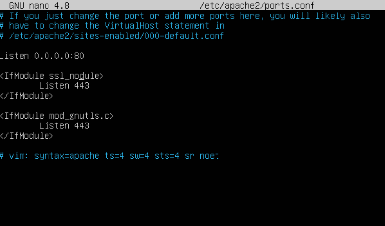

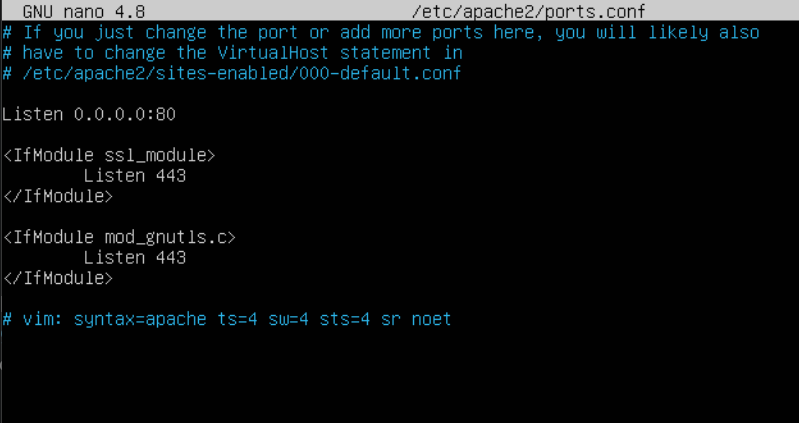

##### Запусти веб-сервер Apache командой `service apache2 start` на ws22 и r1.

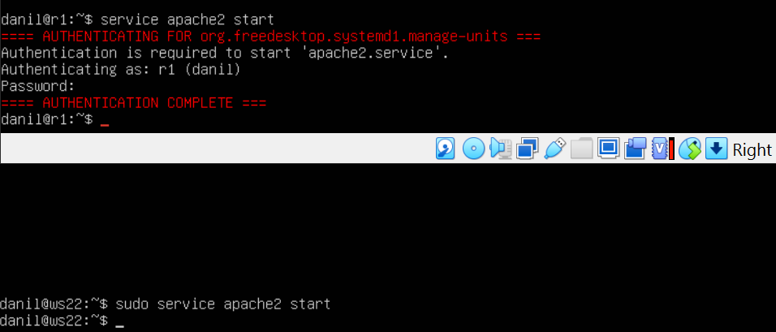

##### Добавили фаервол, созданный по аналогии с фаерволом из Части 4, на r2 со следующими правилами:
##### 1) Удаление правил в таблице filter — `iptables -F`;
##### 2) Удаление правил в таблице «NAT» — `iptables -F -t nat`;
##### 3) Отбрасывать все маршрутизируемые пакеты — `iptables --policy FORWARD DROP`.

Настроенный firewall на r2:  

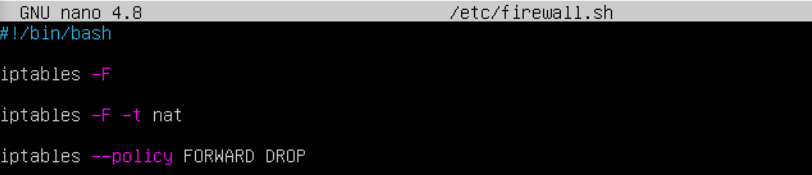

##### Запустили файл также, как в Части 4.

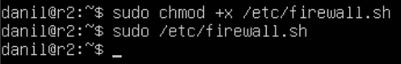

##### Проверили соединение между ws22 и r1 командой `ping`.

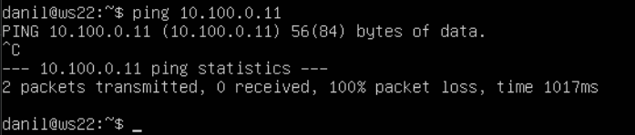

*При запуске файла с этими правилами, ws22 не «пингуется» с r1.*

##### Добавили в файл ещё одно правило:
##### 4) Разрешили маршрутизацию всех пакетов протокола **ICMP**.

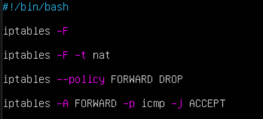

##### Проверяем соединение между ws22 и r1 командой `ping`.

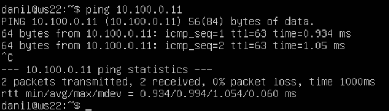

*При запуске файла с этими правилами, ws22  «пингуется» с r1.*

##### Добавим в файл ещё два правила:
##### 5) Включили **SNAT**, а именно маскирование всех локальных IPиз локальной сети, находящейся за r2 (по обозначениям из Части 5 — сеть 10.20.0.0).

##### 6) Включи **DNAT** на 8080 порт машины r2 и добавить к веб-серверу Apache, запущенному на ws22, доступ извне сети.

Измененный firewall:  

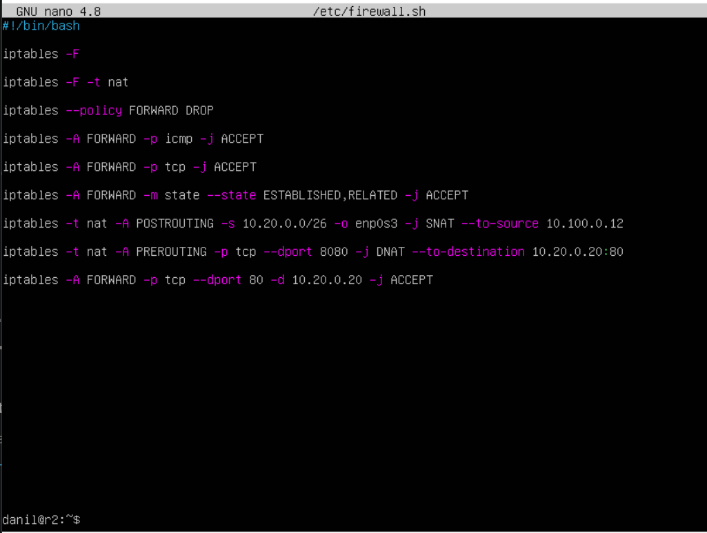

##### Проверяем соединение по TCP для **SNAT**: для этого с ws22 подключаемся к серверу Apache на r1 командой:
`telnet [адрес] [порт]`
##### Проверяем соединение по TCP для **DNAT**: для этого с r1 подключаемся к серверу Apache на ws22 командой `telnet` (обращаться по адресу r2 и порту 8080).

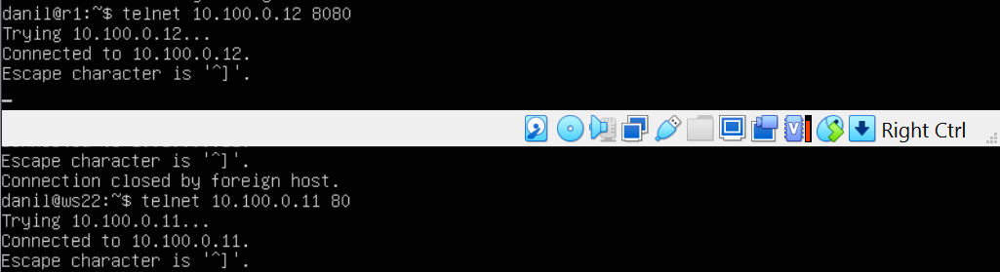

##### Пример работы с bash скриптами:  

Скрипт выводит информацию следующего вида:  

Он находит самые большие файлы, папки,по заданому и сортирует их. Помимо этого высчитывается время работы скрипта в main.sh.  

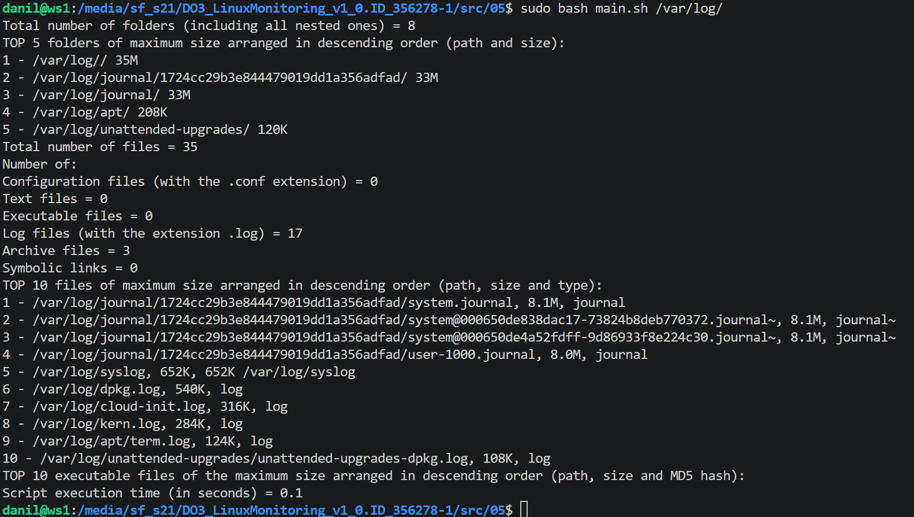

Скрипт логически поделили на 2 части:  

- main.sh - прописываем параметры для управления процессом.
- logic.sh - прописываем саму логику работы скрипта.

Непосредственно сами скрипты:  

*main.sh*

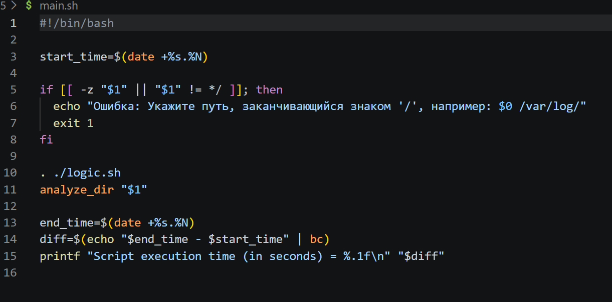

*logic.sh*

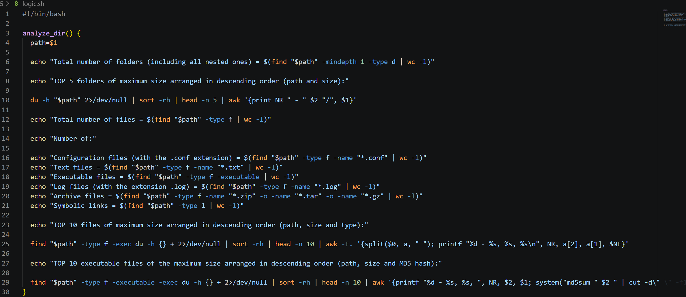